# Bene

Software Developer focused on building scalable backend systems and clean, production-ready architectures.

---

## About

I design and implement maintainable software solutions with a strong emphasis on structure, clarity, and long-term scalability.  
My primary focus is backend development, API design, and cloud-based deployments.

---

## Tech Stack

### Core

### Infrastructure & Tooling

---

## Focus Areas

- .NET / C# Backend Engineering  
- REST API Design  
- Database Architecture (MySQL)
- React Applications 

---

## GitHub Analytics

---

## Contact

Professional inquiries:

Email: [contact@knbene.de](mailto:contact@knbene.de)  
Instagram: [@nxBene](https://www.instagram.com/nxBene/) 
